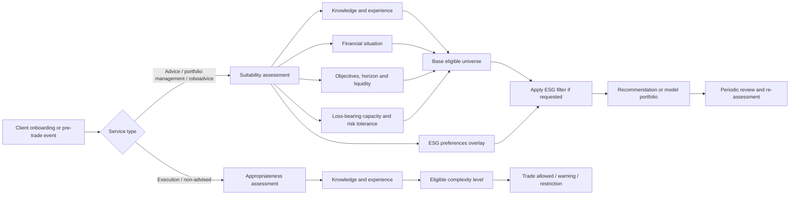
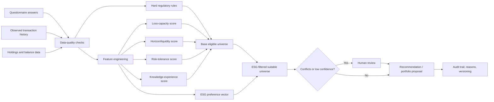

# MiFID Client-Assessment Questionnaires in Spain

## Executive summary

Spanish financial firms do not operate with a single, standardised “MiFID test”. In practice, they use a **layered assessment architecture** that combines: an **appropriateness test** (commonly called *test de conveniencia* in Spain), a **suitability test** (*test de idoneidad*) where advice or discretionary management is provided, one or more **risk-profiling modules**, and, increasingly, a specific **sustainability-preferences layer** integrated into suitability after the MiFID II sustainability amendments. This structure follows the legal logic of MiFID II and its Spanish implementation rather than a single market template. The legal core sits in Article 25 of MiFID II and its delegated rules, as implemented in Spain under the securities-market framework now centred on Law 6/2023.  
**Verified basis:** [MiFID II consolidated text](https://eur-lex.europa.eu/legal-content/EN/TXT/PDF/?uri=CELEX:02014L0065-20240328), [Law 6/2023 (BOE)](https://www.boe.es/eli/es/l/2023/03/17/6/con), [Delegated Regulation 2017/565](https://eur-lex.europa.eu/eli/reg_del/2017/565/oj), [Delegated Regulation 2021/1253](https://eur-lex.europa.eu/eli/reg_del/2021/1253/oj).

The public evidence reviewed shows **three broad market patterns**. First, large universal banks tend to use **legally robust, reusable, multi-purpose questionnaires** covering knowledge, experience, financial situation, objectives, risk tolerance, loss-bearing capacity and, increasingly, sustainability preferences. Second, roboadvisers and digital platforms usually simplify the customer journey and disclose more about the **profiling logic** than about the literal wording of every question; they typically focus on risk capacity, behavioural tolerance of losses, horizon, liquidity and investment experience. Third, brokers and app-led platforms often add **product-specific modules** for complex instruments, thematic or crypto-linked ETPs, or special mandates.  
**Verified examples:** Santander, BBVA, CaixaBank, Bankinter, Ibercaja, ABANCA, ING, Openbank, MyInvestor/entity["organization","Andbank España","bank madrid, spain"], entity["organization","Indexa Capital","roboadvisor madrid, spain"], entity["organization","Finizens","roboadvisor madrid, spain"], entity["organization","Revolut","fintech london, uk"], entity["organization","Renta 4 Banco","bank madrid, spain"] and entity["organization","Singular Bank","private bank madrid, spain"] public materials listed later.

From a regulatory perspective, the key distinction is not semantic but operational. **Appropriateness** asks whether the client has enough knowledge and experience to understand the instrument or service. **Suitability** goes further and asks whether the proposed product, portfolio or strategy matches the client’s knowledge and experience, financial situation, ability to bear losses, investment objectives and risk tolerance. Sustainability preferences belong inside the suitability process as a **post-risk overlay on the eligible universe**, not as a substitute for risk assessment. The strongest public market practice is the one that separates:  
- **can the client understand it?**  
- **can the client economically bear it?**  
- **does the client want it?**  
- **if yes, does the sustainable subset still fit?**

From a data-science perspective, the most important finding is that many questionnaires still mix **hard economic constraints**, **self-declared behavioural preferences**, **knowledge proxies**, and sometimes **commercially convenient UX shortcuts** into a single “profile”. That is analytically fragile. The most defensible design is a **modular model** in which:  
- **loss-bearing capacity** acts as a hard constraint;  
- **risk tolerance** calibrates the recommendation within that constraint;  
- **knowledge and experience** limit product complexity;  
- **horizon and liquidity** shape the investable window;  
- **ESG preferences** filter the remaining eligible products.  

In this report, each statement is treated under one of three lenses:  
- **Verified**: directly supported by a public official or entity source linked below.  
- **Reasonable inference**: a cautious structural reading of how a public process appears to work where the full questionnaire is not published.  
- **Proposal**: my own design recommendation for policy, analytics or questionnaire drafting.

## MiFID II framework applicable in Spain

The legal and supervisory logic relevant in Spain is anchored in MiFID II, its delegated regulation, and the Spanish securities framework, alongside supervisory expectations from entity["organization","CNMV","securities regulator spain"], entity["organization","ESMA","eu securities regulator"] and entity["organization","Banco de España","central bank spain"]. The most important operational distinction is between **appropriateness** and **suitability**.

Under MiFID II, the **appropriateness test** is required when a firm assesses whether a client has the knowledge and experience necessary to understand the risks of a product or service. It is therefore narrower and mainly competency-focused. The firm asks about academic background, professional background, experience with the relevant instrument family, past transactions, frequency, size and recency of prior dealings. In Spain this is usually referred to as the *test de conveniencia*, even though the more precise English regulatory term is *appropriateness*.  
**Verified basis:** [MiFID II, Article 25](https://eur-lex.europa.eu/legal-content/EN/TXT/PDF/?uri=CELEX:02014L0065-20240328), [CaixaBank explanation of MiFID tests](https://www.caixabank.es/particular/cultura-financiera/test-mifid.html), [Bankinter basic MiFID guide](https://docs.bankinter.com/stf/web_corporativa/cumplimiento_normativo/normativa_mifid/mifid_en_bankinter_guia_basica.pdf).

The **suitability test** is broader and applies where the firm gives **investment advice** or provides **portfolio/discretionary management**. In that context, the firm must gather information not only on knowledge and experience, but also on the client’s **financial situation**, including **ability to bear losses**, and the client’s **investment objectives**, including **risk tolerance**. This is the core of the *test de idoneidad* in Spanish market practice. If the information is insufficient, the firm should not provide the advisory or managed service.  
**Verified basis:** [MiFID II, Article 25](https://eur-lex.europa.eu/legal-content/EN/TXT/PDF/?uri=CELEX:02014L0065-20240328), [Delegated Regulation 2017/565](https://eur-lex.europa.eu/eli/reg_del/2017/565/oj), [Ibercaja discretionary management contract](https://www.ibercaja.es/pub/cgcp/257_cg000005av02.pdf), [Santander investment-services information PDF](https://wcm.bancosantander.es/fwm/do-o-8-3-1-informacion_sobre_la_prestacion_de_servicios.pdf).

The post-2022 MiFID sustainability amendments added a further question set: **sustainability preferences**. These do not replace the classic suitability pillars. Instead, they sit on top of them and determine whether, within the products already suitable from risk and financial-situation perspectives, the client also wants products with particular sustainability characteristics. This is now visible in Santander, BBVA, ABANCA, Finizens and Revolut public material.  
**Verified basis:** [Delegated Regulation 2021/1253](https://eur-lex.europa.eu/eli/reg_del/2021/1253/oj), [Santander investment-services information PDF](https://wcm.bancosantander.es/fwm/do-o-8-3-1-informacion_sobre_la_prestacion_de_servicios.pdf), [BBVA pre-trade / advisory documentation](https://www.bbva.es/content/dam/public-web/bbvaes/documents/experiencias/invest/ip-pretrade.pdf), [ABANCA delegated-management page](https://www.abanca.com/es/inversion/cartera-360-fondos-sostenibles/), [Finizens risk-profile guide](https://finizens.com/guia/carteras/perfil-de-riesgo/), [Revolut help pages](https://help.revolut.com/es-ES/help/wealth/available-securities-and-instruments/etps/question-get-started-with-non-crypto-etps/).

A clean analytical reading of the regulatory process looks like this:

The practical differences between the main modules can be summarised as follows:

| Module | Core question | Typical inputs | Typical outcome | Regulatory significance |
|---|---|---|---|---|
| Appropriateness / conveniencia | Can the client understand the instrument or service? | Education, profession, transaction history, familiarity with product class | Warning, pass/fail, or product-complexity restriction | Required for many non-advised sales of non-simple products |
| Suitability / idoneidad | Is the advised product/portfolio right for this client? | Knowledge, experience, financial situation, loss capacity, objectives, horizon, tolerance, ESG | Advisable / not advisable / restricted recommendation universe | Mandatory for advice and discretionary management |
| Risk profile | What aggregate risk envelope is consistent with the client? | Horizon, tolerance, losses, economic resilience, objectives | Profile score or risk band | Operational translation of suitability |
| Knowledge & experience module | Can the client understand product mechanics and risks? | Studies, job, product familiarity, past volumes/frequency | Knowledge score / complexity cap | Often shared by appropriateness and suitability |
| Financial situation module | Can the client financially withstand adverse outcomes? | Income, wealth, debt, commitments, liquidity buffer | Capacity or affordability score | Critical for loss-bearing capacity |
| ESG preferences module | Which sustainability characteristics are desired? | SFDR/taxonomy/PAI-style preference trees | Sustainable subset selection | Must be applied within suitability, not instead of it |

## Comparative review of public evidence across Spanish firms

The table below separates **what is publicly verifiable** from **what remains non-public**. Where I did not locate a sufficiently detailed official public questionnaire, I state that explicitly instead of reconstructing one from assumption.

| Entity | Public evidence located | What is verified from the public record | What remains non-public or only partly visible | Analytical reading |
|---|---|---|---|---|
| entity["organization","Santander","banking group madrid, spain"] | [Investment-services information PDF](https://wcm.bancosantander.es/fwm/do-o-8-3-1-informacion_sobre_la_prestacion_de_servicios.pdf) | The documentation distinguishes appropriateness and suitability; suitability includes knowledge, experience, financial situation, ability to bear losses, objectives, risk tolerance and sustainability preferences; the MiFID test validity stated in the reviewed document is up to 3 years; there are specific rules for joint holders and representatives. | The exact on-screen wording of the full questionnaire is not public in the source reviewed. | Strongly legalistic and reusable architecture, suited to large-bank multi-channel operations. |
| entity["organization","BBVA","banking group bilbao, spain"] | [Risk profile of investment PDF](https://www.bbva.es/content/dam/public-web/bbvaes/documents/legal/tratamiento-de-datos/perfil-de-riesgo-de-inversion.pdf), [pre-trade information](https://www.bbva.es/content/dam/public-web/bbvaes/documents/experiencias/invest/ip-pretrade.pdf), [portfolio-management contract](https://www.bbva.es/content/dam/public-web/bbvaes/documents/legal/tarifas-y-contratos/contrato-tipo-gestion-carteras.pdf) | BBVA publicly states that it uses a simple mathematical formula to assign investment-risk aversion level; it discloses five risk profiles and annual review logic in advisory contexts; sustainability preferences are included in advisory information. | Full questionnaire flow and exact scoring weights are not public. | Particularly relevant for data science because the bank explicitly recognises a formal scoring formula. |
| entity["organization","CaixaBank","banking group valencia, spain"] | [MiFID page](https://www.caixabank.es/particular/inversion/mifid.html), [detailed explanatory article](https://www.caixabank.es/particular/cultura-financiera/test-mifid.html) | CaixaBank publicly explains typical appropriateness questions: education, professional activity, familiarity with products, nature, volume, frequency and period of prior operations. For suitability it adds income, savings, assets, financial commitments, risk tolerance, expected return, purpose and horizon. | Literal final questionnaires are not published in full. | One of the clearest public sources for reconstructing real question families used by large Spanish banks. |
| entity["organization","Bankinter","bank madrid, spain"] | [Basic MiFID guide PDF](https://docs.bankinter.com/stf/web_corporativa/cumplimiento_normativo/normativa_mifid/mifid_en_bankinter_guia_basica.pdf) | Bankinter explains the distinction between tests and states that its advisory service relies on a “preferences” or investment-preferences form; public roboadvisor materials indicate attention to financial assets and savings capacity. | Detailed screen-level or question-level wording is not published in the source reviewed. | Commercially interesting because the public material suggests a protection-first posture, sometimes going beyond the strict minimum friction model. |
| entity["organization","Banco Sabadell","bank alicante, spain"] | [MiFID portal](https://www.bancsabadell.com/bsnacional/es/particulares/mifid/) | Public materials confirm the existence of MiFID policies and client documentation. | I did not locate, in the public review, a sufficiently descriptive official questionnaire that would justify reconstructing its exact design. | Evidence is adequate for governance, not for detailed questionnaire analytics. |
| entity["organization","Unicaja Banco","bank malaga, spain"] | [Investor-profile explanatory article](https://uniblog.unicajabanco.es/-que-tipo-de-inversor-soy--) | Public explanations distinguish financial capacity from tolerance to risk; examples include wealth, income, age and liquidity needs for capacity, and prior experience plus reaction to a 15% fall for tolerance. | Exact questionnaire wording is not visible in the public source reviewed. | Useful for identifying public conceptual structure, less useful for literal questionnaire reconstruction. |
| entity["organization","Ibercaja Banco","bank zaragoza, spain"] | [Client framework / management contract PDF](https://www.ibercaja.es/pub/cgcp/257_cg000005av02.pdf) | Public contractual material shows suitability based on knowledge/experience, objectives, time horizon, financial situation, financial commitments, risk profile and capacity to bear losses; portfolio-model documentation records profile and horizon; review is at least annual in the reviewed management context. | Full operational questionnaire journey is not displayed publicly. | Strong evidence of structured suitability-to-portfolio mapping. |
| entity["organization","ABANCA","bank a coruna, spain"] | [Cartera 360 sustainable funds page](https://www.abanca.com/es/inversion/cartera-360-fondos-sostenibles/) | Before contracting, ABANCA states that it asks about knowledge, experience, objectives, financial situation and sustainability preferences; it discloses profile labelling and VaR 95% style portfolio-risk communication. | Full questionnaire wording and weighting logic are not public. | Good example of how a Spanish bank turns suitability into a simplified proposition for retail clients. |
| entity["organization","ING","banking group amsterdam, netherlands"] | [MiFID information PDF](https://www.ing.es/sobre-ing/pdf/InfMIFID.pdf) | ING publicly distinguishes suitability for advice and appropriateness for MiFID-regulated products/services such as funds and broker services. | The detailed questionnaire is not publicly visible in the source reviewed. | Standard modular design, limited public transparency on the exact test. |
| entity["organization","Openbank","bank madrid, spain"] | [Robo-advisor / managed portfolios page](https://www.openbank.es/inversiones/robo-advisor-gestion-carteras) | Openbank publicly states that it uses idoneidad information on knowledge/experience, objectives, financial situation, risk tolerance and loss-bearing capacity; it discloses a five-profile structure and approximate volatility bands. | Full wording and sequencing of the questionnaire are not public. | Strong digital-suitability example translating profiling into portfolio choice with relatively transparent risk language. |
| entity["organization","MyInvestor","digital investment platform spain"] | [FAQ](https://myinvestor.es/ayuda/preguntas-frecuentes/inversion/), [Andbank/ MiFID brochure PDF](https://blog.myinvestor.es/wp-content/uploads/2020/09/Folleto_MIFID_02-09-2020.pdf) | Public material states that both appropriateness and suitability testing are used; the reviewed brochure indicates annual validity; suitability covers knowledge/experience, financial situation, objectives and tolerance; public FAQs indicate that different pockets of wealth may pursue different objectives. | Full final questionnaire not published. | Hybrid digital-bank / advisory design, modular and compatible with portfolio-level profiling. |
| Indexa Capital | [Questions/support page](https://indexacapital.com/es/esp/questions), [risk-calculation explanation](https://support.indexacapital.com/es/esp/calculo-perfil-riesgo) | Indexa publicly discloses that its onboarding includes 15 questions, separates capacity from tolerance, uses a numeric risk-profile scale and applies a weighting mechanism that constrains the final result toward the lower of the key dimensions; updates are required at least every two years. | Full exact questionnaire text is not posted as a single form in the reviewed source, though the methodology is unusually transparent. | The most analytically transparent public roboadvisor methodology in Spain among the sources reviewed. |
| Finizens | [Risk-profile guide](https://finizens.com/guia/carteras/perfil-de-riesgo/) | Finizens explains that it asks about personal situation, prior experience, objectives, risk capacity and tolerance, and sustainability; public legal material shows a 1/6 to 6/6 style profile range and asset-allocation bands. | Full question wording and scoring weights are not public. | Good public evidence of digital suitability translated directly into portfolio construction. |
| entity["organization","Revolut","fintech london, uk"] | [Help centre on non-crypto ETPs](https://help.revolut.com/es-ES/help/wealth/available-securities-and-instruments/etps/question-get-started-with-non-crypto-etps/) and related wealth help content | Revolut publicly indicates separate questionnaires for certain complex securities and for roboadvisor-like wealth propositions, covering at least experience, knowledge, financial situation, objectives and risk-related dimensions. | Full wording, decision rules and Spain-specific implementation detail are only partially public. | Good example of product-specific modularity in an app-led environment. |
| entity["organization","Renta 4 Banco","bank madrid, spain"] | [Crypto/ETP article](https://www.r4.com/articulos-y-analisis/ideas/criptomonedas-una-nueva-oportunidad-de-inversion), [privacy policy](https://www.r4.com/normativa/politica-privacidad/politica-privacidad-clientes) | Public material refers to convenience, suitability and target-market controls; in the crypto/ETP context it refers to additional questions on prior experience with crypto underlyings and related products; the privacy policy states that modelling and propensity tools are subject to human supervision. | Full standard-form MiFID test is not publicly visible in the reviewed sources. | Highly relevant case where MiFID meets advanced analytics and more complex products. |
| Singular Bank / legacy Self Bank | [Privacy policy PDF](https://www.singularbank.es/doc/legal/politica-privacidad22.pdf) | The legal/privacy material refers to results of appropriateness and suitability tests and related MiFID documentation. | I did not locate a detailed public questionnaire. | Enough evidence to confirm use of MiFID outcomes, not enough to reconstruct questionnaire structure. |

Two additional points are important. First, **EVO Banco** was part of the requested perimeter, but in this review I did **not** locate a sufficiently detailed official public questionnaire or legal description to support a robust comparative reconstruction. Second, where there is no public questionnaire, the right analytical approach is **not** to invent one, but to build **generic patterns** grounded in regulation and in the structures observable at peer firms. That is the approach taken in the example-questionnaire section below.

Commercially, the divergence between firms is not mainly about what they ask, but about **how much friction they are prepared to impose**, **how transparent they are about scoring**, and **how far they separate legal eligibility from sales UX**. The larger banks appear to favour reusable questionnaires and stronger legal boilerplate. Roboadvisers disclose more about logic and portfolio mapping. App-led platforms add product-specific modules and dynamic gating for complexity.

## Taxonomy of MiFID questions and example questionnaires

The most useful way to classify MiFID questionnaire questions is by **purpose**, not by literal wording. Different firms ask similar things in different language, but the measurement intent is usually the same.

A practical taxonomy of the question space is this:

1. **Personal and life-context data**  
   Age, household status, dependants, expected use of funds, stage of life, retirement timing, emergency needs.  
   Purpose: horizon, liquidity, capacity and behavioural context.

2. **Education and professional background**  
   Level of education, finance-related training, current and prior profession, employment stability.  
   Purpose: proxy for understanding, sophistication and income stability.

3. **Financial resilience**  
   Net income band, other recurring income, savings capacity, patrimony/financial assets, liabilities, debt service, buffer/liquidity reserve.  
   Purpose: economic suitability and loss-bearing capacity.

4. **Knowledge and experience**  
   Product families known, products traded before, transaction frequency, typical size, recency and duration of prior experience.  
   Purpose: appropriateness and complexity gating.

5. **Objectives and use case**  
   Purpose of investment, target date, need for income, capital preservation, growth, retirement, children’s education, specific liabilities.  
   Purpose: portfolio construction and horizon consistency.

6. **Risk and loss behaviour**  
   Reaction to market falls, maximum temporary loss acceptable, trade-off between return and volatility, sleep-at-night threshold.  
   Purpose: tolerance calibration.

7. **Liquidity and flexibility**  
   Time until possible withdrawal, liquidity preference, willingness to lock capital, emergency-access needs.  
   Purpose: prevent mismatch between product liquidity and client needs.

8. **ESG preferences**  
   Desire for sustainable strategies, minimum sustainable allocation, taxonomy or PAI-like preferences, flexibility if product range narrows.  
   Purpose: sustainable subset filtering within the suitable universe.

The table below maps those question families to data and regulation.

| Test type / module | Variable measured | Example question | Typical response format | Possible data feature | Main bias or misreading risk | Segmentation utility | Product-recommendation utility | Regulatory relevance |
|---|---|---|---|---|---|---|---|---|
| Personal context | Life stage and likely time horizon | “When do you expect to need this money?” | Ordinal buckets | `years_to_need_funds` | Client gives aspirational rather than real horizon | High | High | High in suitability |
| Personal context | Household pressure / contingent liquidity need | “Could you need to withdraw within 12 months?” | Yes/no + amount | `short_term_liquidity_flag` | Underreporting emergency needs | Medium | High | High |
| Education | Formal knowledge proxy | “What is your highest level of education?” | Ordinal | `education_level_code` | Overstates understanding of financial products | Low to medium | Medium | Medium |
| Profession | Professional familiarity / income stability | “Do you work or have you worked in financial services?” | Categorical | `finance_profession_flag` | Job title used as weak proxy for true competence | Medium | Medium | Medium |
| Income | Recurring economic capacity | “What is your annual net income range?” | Band | `income_band` | Self-report error / outdated information | High | High | Very high |
| Savings | Free cash-flow and resilience | “How much can you save monthly?” | Band | `savings_capacity_ratio` | Optimism bias | High | High | High |
| Assets | Wealth and room for loss | “What is your financial wealth excluding your main home?” | Band / numeric | `liquid_wealth_band` | Incomplete disclosure / valuation inconsistency | High | Very high | Very high |
| Liabilities | Financial burden | “What are your monthly debt commitments?” | Band / numeric | `debt_service_ratio` | False precision or omission | High | Very high | Very high |
| Knowledge | Product familiarity | “Which of these products do you know well enough to explain their main risks?” | Checklist + confidence | `knowledge_index` | Familiarity mistaken for understanding | Medium | High | Very high in appropriateness |
| Experience | Prior practical exposure | “How many transactions in investment funds have you made in the last 3 years?” | Bands | `fund_txn_count_band` | Memory bias | High | High | Very high |
| Experience | Recency and scale | “What was the usual amount invested per operation?” | Bands | `avg_ticket_band` | Clients round or signal status | Medium | Medium to high | High |
| Objective | Purpose of money | “What is the main aim of this investment?” | Single choice / ranked | `investment_objective` | Multiple aims forced into one answer | High | Very high | Very high |
| Horizon | Holding period | “How long are you prepared to keep the investment?” | Ordinal | `investment_horizon_years` | Long horizons overstated in bull markets | High | Very high | Very high |
| Liquidity | Need for access | “How important is daily liquidity?” | Likert scale | `liquidity_preference_score` | Clients say they want both liquidity and high return | Medium | High | High |
| Risk tolerance | Behavioural willingness to face volatility | “If your portfolio fell 15%, what would you do?” | Scenario choices | `drawdown_reaction_score` | Answers are mood-sensitive and cyclical | High | High | High |
| Loss capacity | Economic ability to bear loss | “What loss on this investment could you absorb without affecting your finances?” | Band / scenarios | `loss_capacity_pct` | Client confuses willingness with ability | Very high | Very high | Critical |
| Return expectation | Desired upside | “What annual return do you expect?” | Band | `return_expectation_band` | Often captures aspiration, not realism | Low to medium | Medium | Medium |
| Advisory need | Need for human support | “Do you want ongoing advice or an execution-only service?” | Categorical | `advice_need_flag` | Channel preference confused with competence | Medium | High | High for service classification |
| ESG | Sustainability preference intensity | “Do you want investments with specific sustainability characteristics?” | Yes/no + tree | `esg_pref_type` | Values/preferences mistaken for risk appetite | Medium | High as filter | High after 2022 changes |

### Example questionnaire patterns

The following examples are **proposals**, not reconstructions of any unpublished proprietary form. They are designed from regulatory patterns visible in the public sources reviewed.

**Basic retail MiFID questionnaire**  
Suitable for a general retail onboarding context where the firm wants a single intake form that can later branch into appropriateness or suitability:
1. What is the main purpose of this investment?  
2. When are you likely to need the money?  
3. What is your annual net income range?  
4. What is your approximate liquid financial wealth?  
5. What are your recurring debt commitments?  
6. How much of this money could you afford to lose without affecting essential plans?  
7. Which investment products have you previously used?  
8. How often have you invested in the last 3 years?  
9. How would you react to a 15% market fall?  
10. Do you want investments with sustainability characteristics to be considered?

**Appropriateness questionnaire for fund distribution**  
Focused on whether the client understands funds and basic collective-investment risk:
1. Highest educational level.  
2. Whether the client has worked in a finance-related role.  
3. Products previously invested in: deposits, funds, ETFs, shares, bonds, derivatives.  
4. Number of fund transactions over the last 3 years.  
5. Average amount per transaction.  
6. Understanding that a fund’s value may fall as well as rise.  
7. Understanding of liquidity, duration, credit or currency risk if relevant to the sub-fund.  
8. Confirmation that past performance does not guarantee future returns.

**Suitability questionnaire for advisory service**  
Built for advisory or managed portfolios:
1. Investment purpose.  
2. Target date / horizon.  
3. Desired balance between capital preservation and growth.  
4. Net income and regular expenses.  
5. Liquid wealth and illiquid wealth.  
6. Debts and financial commitments.  
7. Emergency reserve in months of expenses.  
8. Percentage of total wealth represented by the investment under consideration.  
9. Prior experience by product family.  
10. Reaction to 10%, 20% and 30% falls.  
11. Maximum acceptable temporary loss.  
12. Sustainability preferences and flexibility if the product universe narrows.

**Roboadviser questionnaire**  
Optimised for digital onboarding without removing regulatory essentials:
1. Age or expected date of retirement / planned spending need.  
2. Initial amount and monthly contributions.  
3. Main goal of the account.  
4. Years until expected use of funds.  
5. Annual income and savings rate.  
6. Liquid assets and debt.  
7. Expected reaction to three downturn scenarios.  
8. Previous experience with funds, ETFs, shares and complex products.  
9. Need for withdrawals in the next 1–3 years.  
10. Sustainability preference filter.  
11. Confirmation of understanding that capital is not guaranteed.

**Complex-products appropriateness questionnaire**  
For derivatives, structured products, leveraged ETPs, crypto-linked ETPs or other high-complexity instruments:
1. Prior experience specifically with the product family or highly comparable products.  
2. Number and size of transactions in the product family over a recent period.  
3. Understanding of leverage and amplified losses.  
4. Understanding of total-loss risk if applicable.  
5. Understanding of issuer / counterparty risk.  
6. Understanding of liquidity risk and potential inability to exit at fair value.  
7. Understanding of product mechanics, including scenarios where returns differ sharply from spot exposure.  
8. Confirmation that the product may not be appropriate for inexperienced investors.

**ESG-focused suitability add-on**  
To overlay on classic suitability rather than replace it:
1. Do you want sustainability preferences taken into account?  
2. If yes, are you seeking products with sustainable-investment characteristics, taxonomy alignment, or adverse-impact considerations?  
3. What minimum degree of sustainability is important to you, if any?  
4. Would you accept a narrower product universe in order to preserve those preferences?  
5. Are your ESG preferences strict or flexible if there is no exact match consistent with your risk profile and investment objective?

**Data-science-oriented questionnaire design**  
This is a proposal for a more analytics-ready but still defensible architecture:
1. All classic suitability questions.  
2. Timestamp, channel and device metadata.  
3. Time spent per question.  
4. Change history versus prior questionnaire.  
5. Confidence self-rating for each critical answer.  
6. Internal consistency checks.  
7. Percentage of available liquid assets represented by the proposed investment.  
8. Whether the client has previously ignored risk warnings.  
9. Whether the client has a documented liquidity event ahead.  
10. Whether the client wants advice, guided execution or self-directed execution only.

Such a design should **never** treat behavioural metadata as a substitute for mandatory suitability information, but it can be valuable for **quality control**, **misunderstanding detection** and **human-review triggers**.

## Data-science interpretation and variable utility

The strongest public evidence from the reviewed firms suggests that the market is slowly moving from “questionnaire as compliance form” to “questionnaire as structured decision input”. BBVA explicitly refers to a formula-based risk assignment. Indexa publicly discloses the logic that combines loss capacity and tolerance. Renta 4 discloses the use of models and propensity tools under human supervision. Those signals matter because they show the shift from legal form-filling toward decision systems.  
**Verified basis:** [BBVA risk-profile PDF](https://www.bbva.es/content/dam/public-web/bbvaes/documents/legal/tratamiento-de-datos/perfil-de-riesgo-de-inversion.pdf), [Indexa risk-calculation explanation](https://support.indexacapital.com/es/esp/calculo-perfil-riesgo), [Renta 4 privacy policy](https://www.r4.com/normativa/politica-privacidad/politica-privacidad-clientes).

From a predictive perspective, the most useful variables are usually **not** the most “psychological” ones. The variables with the highest real signal for long-term fit and complaint-risk control are generally those linked to **liquidity need**, **investment horizon**, **debt burden**, **free saving capacity**, **liquid wealth**, **concentration of the proposed investment**, and **verified prior experience**. Behavioural tolerance questions are useful, but they are more volatile and more exposed to current market mood.

The following table maps the main variables to data-science value and risk.

| Variable family | Regulatory necessity | Likely predictive power for client-product fit | Typical noise source | Redundancy risk | Good feature-engineering options | Useful external/internal enrichment | Main legal or governance caution |
|---|---|---|---|---|---|---|---|
| Income | Very high | High | Self-report lag | Medium with savings and assets | Income bands, income stability flag | Payroll/account inflow history if lawfully available | Purpose limitation |
| Savings capacity | High | High | Optimism bias | Medium with income | Savings-to-income ratio | Current-account saving pattern | Avoid covert behavioural scoring without transparency |
| Liquid financial wealth | Very high | Very high | Incomplete disclosure | Medium with assets | Log-binned wealth, wealth-to-investment ratio | Custody data, portfolio positions | Data freshness and valuation consistency |
| Debt and commitments | Very high | Very high | Omission / underreporting | Low | Debt-service ratio, debt-to-income ratio | Account data, documented liabilities | Accuracy and explainability |
| Amount to invest vs wealth | Critical | Very high | One-off events | Low | Concentration percentage | Existing balances and transfers | Must act as a hard control, not just a feature |
| Horizon | Very high | High | Aspirational answers | Medium with age/life stage | Years to target, short-term liquidity flag | Product maturity calendars | Must match product liquidity |
| Loss-bearing capacity | Critical | Very high | Many clients confuse it with willingness | Medium with wealth and savings | Loss-capacity ratio | Existing financial commitments | Hard-stop logic needed |
| Risk tolerance scenarios | High | Medium | Market sentiment and framing effects | Medium with horizon and objective | Scenario score, stress-response index | Historic behaviour under drawdowns if lawfully available | Needs careful explanation |
| Experience by product class | Very high | High | Recall bias | Medium with knowledge | Experience-weighted complexity score | Historic transaction records | Best if based on observed history, not self-report only |
| Knowledge self-assessment | High | Medium to low | Overconfidence | High with education/profession | Confidence-adjusted knowledge score | Completion behaviour / incorrect comprehension checks | Self-assessment alone is weak |
| Education | Medium | Low to medium | Poor proxy | High with profession/knowledge | Ordinal code only | None usually needed | High proxy-bias risk if overweighted |
| Profession | Medium | Low to medium | Titles mislead | High with education/knowledge | Binary finance-related flag | Employer domain, if lawfully captured | Risk of unfair proxy use |
| ESG preferences | High where suitability applies | Low for risk, high for allocation filtering | Values expressed vaguely | Low | ESG vector / preference tree | Existing SFDR-labelled holdings | Must not distort risk score |
| Advisory need | High for service design | Medium | Channel preference ≠ knowledge | Medium | Advice/execution flag | Past service usage | Avoid directing higher-risk products to “self-directed” users without basis |
| Behavioural metadata | Low direct MiFID relevance | Medium to high for QA | Digital-literacy effects | Low | response_time_outlier, inconsistency flags | Session logs, abandonment patterns | Transparency, profiling fairness, GDPR controls |

### Critical evaluation of current questionnaire quality

From a **regulatory** perspective, the strongest questionnaires are those that clearly separate:
- product understanding;
- financial resilience;
- objectives and horizon;
- behavioural tolerance;
- ESG preferences.

From a **commercial** perspective, the best questionnaires are not always the shortest ones. Short forms improve conversion, but if they collapse too many dimensions into a handful of multiple-choice questions, the firm creates two risks at once: a weaker recommendation and a weaker evidential record in complaints or supervisory review.

From a **data-science** perspective, the most common weaknesses are these:

**Noisy questions**  
Questions such as “What return do you expect?” or “How much risk are you willing to take?” are often weak on their own because they capture aspiration or self-image more than actual constraints.

**Proxy-heavy design**  
Education and profession can help, but they are weak substitutes for observed experience. A client with a finance degree may not understand the mechanics of a structured product; a retired engineer may be very experienced in ETFs and bond funds.

**Redundancy**  
Income, wealth and savings capacity overlap. So do education, profession and self-assessed knowledge. A well-designed model should not allocate excessive weight to correlated variables.

**Context sensitivity**  
If a questionnaire is completed during a market rally, more clients report aggressive preferences. If it is completed after a sharp drawdown, the same clients often become more conservative. This means tolerance questions need stabilisers and consistency checks.

**False precision**  
Many forms ask for very granular financial data but then bin them coarsely into broad categories. If the downstream logic is category-based, apparent detail may create user burden without analytical benefit.

**Lack of behavioural validation**  
The best evidence of experience is not the client saying “I understand bonds”; it is actual transaction history, holding duration, reaction to prior market movements and documented interaction with information materials. Where lawfully available and appropriately disclosed, observed behaviour is usually superior to self-report.

## Conceptual scoring model and advanced analytics

A defensible investor-scoring model under MiFID should not simply “predict a profile”. It should operate as a **layered decision system with constraints**. The aim is not to replace the legal process but to make it more coherent, more auditable and less prone to commercial drift.

### Conceptual model

I recommend a five-block structure:

| Dimension | Indicative weight | Function in the model | Typical inputs |
|---|---:|---|---|
| Loss-bearing capacity / financial resilience | 35% | **Hard constraint** on maximum feasible risk | Income, savings capacity, liquid wealth, debt, emergency buffer, concentration ratio |
| Objectives, horizon and liquidity | 20% | Determines whether the money can be exposed to medium/long-term risk | Goal, time to need, liquidity requirement, planned withdrawals |
| Risk tolerance | 20% | Calibrates portfolio within the feasible envelope | Drawdown scenarios, stability-vs-growth trade-off, stated volatility comfort |
| Knowledge and experience | 20% | Caps product complexity and supports appropriateness | Product history, recency, frequency, size, profession/education only as weak support |
| ESG preferences | 5% as overlay, not as risk accelerator | Filters the suitable product universe after base suitability is established | Sustainability preference tree |

This is a **proposal**, not a claim about any one institution’s exact internal model. The reason for the heavier weight on loss-bearing capacity is that it is the part most directly tied to the regulatory protection aim: the client should not be recommended a level of risk that would be financially damaging even if the client says “I am aggressive”.

The model should be organised like this:

### Validation rules

Any serious MiFID-scoring model should include at least the following rules:

1. **Hard stop on low loss capacity**  
   If the proposed investment would create undue concentration or would not be economically bearable, the model should cap the risk outcome irrespective of the client’s stated tolerance.

2. **Hard stop on insufficient knowledge for complex products**  
   Even if a client is wealthy and states high tolerance, lack of relevant experience should prevent frictionless access to certain complex instruments without enhanced warnings or a controlled review path.

3. **Consistency control**  
   Contradictions such as “I may need the money next year” plus “I can tolerate a 30% fall” should trigger review or score downgrading.

4. **Staleness control**  
   Questionnaire validity should not be indefinite. Public practice ranges from annual review in some contexts to multi-year validity in others, depending on service and institution. The model should store both completion date and material-change flags.

5. **ESG feasibility control**  
   Where sustainability preferences materially narrow the product universe, the system should explicitly document whether the preference is strict or flexible and whether the match is possible without breaking suitability.

6. **Explainability requirement**  
   Each output should be accompanied by a small number of reason codes that a compliance officer and relationship manager can understand.

### Regulatory alerts and limitations

A scoring model of this kind must not drift into:
- hidden margin optimisation;
- forcing higher-risk products onto digitally “confident” clients;
- using socio-economic proxies without necessity;
- silently downgrading or upgrading clients based on opaque behavioural data.

The final output should ideally be a **continuous score plus documented constraints**, not a mysterious black-box classification. As requested, I do **not** list end-state investor segments here.

### Traditional questionnaire logic versus advanced approaches

Advanced analytics can add value, but it should sit **on top of** a rules-based regulatory core, not replace it.

| Approach | What it adds | Where it is most useful | Main risk | Fit with MiFID governance |
|---|---|---|---|---|
| Traditional rules-based questionnaire | Strong explainability and legal defensibility | Core suitability/appropriateness workflow | Coarse, static, sometimes low predictive power | Essential baseline |
| Supervised machine learning | Predicts misfit, complaint risk, override risk, early redemption or instability | QA layer, post-sale monitoring, profile-confidence scoring | Opaque drivers, proxy bias, drift | Good only with strong explainability and model controls |
| Clustering | Finds latent client behaviour patterns beyond declared profile | Portfolio-behaviour analysis, service design | Clusters can be unstable and hard to justify to supervisor | Better for analytics than for frontline decisioning |
| Recommender systems | Ranks products within an already suitable universe | Fund shelves, large product ranges, guided architecture | Can turn suitability into sales optimisation if uncontrolled | Useful only after suitability restrictions are applied |
| Propensity models | Predicts likelihood to invest or accept advice | Campaign strategy, timing, channel allocation | High conflict-of-interest risk if connected to suitability outcome | Must remain separate from suitability engine |
| Product-client matching engines | Enforces rule-based compatibility between product features and client features | Strong for large architectures and product governance | Garbage-in/garbage-out if taxonomy is poor | Highly aligned when grounded in target-market logic |
| Explainable AI | Produces reason codes, sensitivity analysis, challenge tools | Internal review, complaints handling, model validation | “Cosmetic explainability” if the core model is still opaque | Very valuable |
| Model governance and traceability | Versioning, audit trails, override controls, monitoring | Entire lifecycle | Process overhead | Non-negotiable for serious deployment |

My overall assessment is that **advanced analytics is best used for control, calibration and monitoring**, not for replacing the core legal questionnaire. A strong design principle is: **rules decide eligibility; models improve confidence, QA and monitoring**.

## Risks, limitations and project opportunities

### Regulatory, ethical and bias risks

The main regulatory risk is **misalignment of objective**. If the model’s real optimisation target becomes product uptake, assets gathered, fee income or campaign conversion, the firm can easily drift away from the protection logic of MiFID.

The second major risk is **proxy bias**. Age, education, profession and digital fluency can be analytically convenient, but they are not strong enough on their own to justify suitability decisions. Overweighting them may create unfair outcomes and weak complaint defensibility.

The third risk is **behavioural-data overreach**. Session logs, time spent on documents, click-stream patterns or app behaviour can be very useful for detecting misunderstanding or low confidence, but using them to infer risk appetite without transparent governance is difficult to defend. Under GDPR principles, firms need clear purpose limitation, transparency, minimisation and traceability.  
**Official legal basis:** [GDPR](https://eur-lex.europa.eu/eli/reg/2016/679/oj).

The fourth risk is **automation without human challenge**. A suitability engine should have a review channel for contradictions, vulnerable clients, edge cases, sudden profile changes, large concentrations, and complex-product requests.

The fifth is **data quality risk**. Financial-situation data decays quickly. If the model is fed with stale income, wealth or debt data, the precision suggested by the score is false.

### Limitations of the present study

This study is based on **publicly available materials**. In several firms, the public record contains:
- legal or contractual PDFs;
- explanatory pages;
- FAQs;
- privacy policies;
- roboadviser descriptions.

It often does **not** contain the full literal questionnaire, exact scoring weights, or channel-specific screen flows. Where exact wording was not public, I have stated that rather than reconstructing a pseudo-verbatim form. Likewise, I did not include screenshots because the public record is dominated by legal documents and changing digital UIs; the analytical diagrams above are more stable and more useful for comparison.

### Data-science project opportunities

There is a strong opportunity for a practical banking or academic project that does **not** try to replace MiFID forms, but instead improves their precision, governance and value.

A realistic project portfolio would include:

| Use case | Minimum dataset needed | Recommended variables | Suitable metrics | Main legal / ethical issue |
|---|---|---|---|---|
| Profile-confidence scoring | Questionnaire answers, timestamps, historic profile changes | Inconsistency flags, time-to-answer, change magnitude, wealth concentration | Precision/recall on manual-review flags | Transparent profiling |
| Complaint-risk early warning | Questionnaire history, recommendations, complaints/incidents | Loss-capacity mismatch, short-horizon/high-risk mismatch, override events | AUC, recall on complaints, uplift analysis | Avoid self-fulfilling feedback loops |
| Appropriateness-quality monitoring | Appropriateness answers, product trades, warnings issued | Experience score, warning acceptance, product complexity | Warning rate, post-warning trade incidence, error analysis | Must not be used to pressure sales |
| Suitability drift monitoring | Questionnaire dates, portfolios, withdrawals, life-event markers | Staleness, large drawdown reactions, premature redemptions | Drift metrics, stability score, survival analysis | Data freshness and fairness |
| Product-client matching engine | Product taxonomy, client features, target-market rules | Complexity, liquidity, risk, horizon, ESG features | Mismatch rate, override rate, audit exceptions | Product governance alignment |
| ESG-preference feasibility engine | ESG responses, product SFDR/taxonomy attributes | ESG vector, flexibility flags, risk constraints | Match rate, manual intervention rate | Greenwashing and over-interpretation risk |
| Human-review triage | Full onboarding record + outcomes | Uncertainty score, contradictions, complex-product flags | Reduction in unnecessary manual reviews, SLA impact | Human oversight must remain real |

### Minimum viable dataset

A strong minimum analytical dataset would contain:
- pseudonymised client ID;
- questionnaire version and date;
- individual answers by question;
- derived scores by module;
- risk warnings issued;
- final recommendation universe or portfolio proposal;
- whether the client proceeded against a warning where legally possible;
- product subscribed / not subscribed;
- periodic review status;
- relevant subsequent events such as early withdrawal, complaint, override or profile change.

If permitted by governance and legal basis, the dataset becomes much more powerful with:
- actual transaction history by product class;
- holdings and concentration data;
- cash-flow or savings behaviour from current accounts;
- historic reaction to market stress;
- engagement with disclosure materials.

### Analytical hypotheses worth testing

For a TFM or professional project, the most valuable hypotheses would be:

1. **Financial-capacity variables predict long-term appropriateness of risk more strongly than self-declared risk appetite.**  
2. **Clients with inconsistent questionnaire responses are more likely to trigger warnings, overrides or later dissatisfaction.**  
3. **Observed experience and behaviour are more reliable than self-declared knowledge for complex-product gating.**  
4. **An ESG overlay applied after base suitability produces fewer regulatory conflicts than ESG embedded directly into a single risk score.**  
5. **Explainable confidence scores can reduce manual-review workload without weakening client protection.**

### TFM or professional project ideas

The most practical project ideas would be:
- a **MiFID questionnaire quality index** for retail banking;
- a **rule-plus-model suitability-control engine** with reason codes;
- a **profile-drift detector** using re-assessment and behavioural data;
- a **complex-product appropriateness challenger** based on observed experience;
- an **ESG preference matching engine** with regulatory override logging;
- a **complaint-risk model** built from suitability contradictions and concentration flags;
- a **model-governance framework** for AI in wealth distribution.

## Conclusions and sources

The Spanish market shows strong convergence on the **building blocks** of MiFID assessment and much more divergence in **implementation style**. The public evidence suggests that banks, brokers, roboadvisers and app-led platforms are all asking roughly the same underlying questions, but they package them differently: large banks emphasise legal resilience and reusable documentation; roboadvisers emphasise lower friction and more transparent portfolio mapping; specialist platforms add product-specific gating for complexity.

The best regulatory design is not the one with the greatest number of questions. It is the one that cleanly separates:
- knowledge/experience;
- economic loss-bearing capacity;
- objectives, horizon and liquidity;
- behavioural tolerance;
- ESG preferences.

The best commercial design is not the one with the lowest friction at any cost. It is the one that reduces friction **without collapsing distinct regulatory dimensions into one opaque score**.

The best data-science design is not a black box that predicts a profile label. It is a constrained, auditable architecture where:
- eligibility rules remain explicit;
- scores are modular and explainable;
- models improve QA, calibration and monitoring;
- human challenge remains possible;
- product recommendation never outruns suitability.

### Sources with links

**Primary legal and regulatory sources**
- [Directive 2014/65/EU (MiFID II), consolidated text – EUR-Lex](https://eur-lex.europa.eu/legal-content/EN/TXT/PDF/?uri=CELEX:02014L0065-20240328)
- [Commission Delegated Regulation (EU) 2017/565 – EUR-Lex](https://eur-lex.europa.eu/eli/reg_del/2017/565/oj)
- [Commission Delegated Regulation (EU) 2021/1253 – EUR-Lex](https://eur-lex.europa.eu/eli/reg_del/2021/1253/oj)
- [Law 6/2023 on Securities Markets and Investment Services – BOE](https://www.boe.es/eli/es/l/2023/03/17/6/con)
- [Regulation (EU) 2016/679 (GDPR) – EUR-Lex](https://eur-lex.europa.eu/eli/reg/2016/679/oj)

**Entity and market-practice sources reviewed**
- [Santander – information on investment services (PDF)](https://wcm.bancosantander.es/fwm/do-o-8-3-1-informacion_sobre_la_prestacion_de_servicios.pdf)
- [BBVA – investment risk profile (PDF)](https://www.bbva.es/content/dam/public-web/bbvaes/documents/legal/tratamiento-de-datos/perfil-de-riesgo-de-inversion.pdf)
- [BBVA – pre-trade investment information (PDF)](https://www.bbva.es/content/dam/public-web/bbvaes/documents/experiencias/invest/ip-pretrade.pdf)
- [BBVA – portfolio-management contract (PDF)](https://www.bbva.es/content/dam/public-web/bbvaes/documents/legal/tarifas-y-contratos/contrato-tipo-gestion-carteras.pdf)
- [CaixaBank – MiFID information page](https://www.caixabank.es/particular/inversion/mifid.html)
- [CaixaBank – explanatory article on the MiFID test](https://www.caixabank.es/particular/cultura-financiera/test-mifid.html)
- [Bankinter – basic MiFID guide (PDF)](https://docs.bankinter.com/stf/web_corporativa/cumplimiento_normativo/normativa_mifid/mifid_en_bankinter_guia_basica.pdf)
- [Banco Sabadell – MiFID portal](https://www.bancsabadell.com/bsnacional/es/particulares/mifid/)
- [Unicaja – investor-type explanatory article](https://uniblog.unicajabanco.es/-que-tipo-de-inversor-soy--)
- [Ibercaja – contractual documentation (PDF)](https://www.ibercaja.es/pub/cgcp/257_cg000005av02.pdf)
- [ABANCA – Cartera 360 sustainable funds](https://www.abanca.com/es/inversion/cartera-360-fondos-sostenibles/)
- [ING – MiFID information (PDF)](https://www.ing.es/sobre-ing/pdf/InfMIFID.pdf)
- [Openbank – robo-advisor / managed portfolios](https://www.openbank.es/inversiones/robo-advisor-gestion-carteras)
- [MyInvestor – investment FAQs](https://myinvestor.es/ayuda/preguntas-frecuentes/inversion/)
- [MyInvestor / Andbank – MiFID brochure (PDF)](https://blog.myinvestor.es/wp-content/uploads/2020/09/Folleto_MIFID_02-09-2020.pdf)
- [Indexa Capital – questions page](https://indexacapital.com/es/esp/questions)
- [Indexa Capital – risk-profile methodology](https://support.indexacapital.com/es/esp/calculo-perfil-riesgo)
- [Finizens – risk-profile guide](https://finizens.com/guia/carteras/perfil-de-riesgo/)
- [Revolut – help centre on non-crypto ETP appropriateness](https://help.revolut.com/es-ES/help/wealth/available-securities-and-instruments/etps/question-get-started-with-non-crypto-etps/)
- [Renta 4 – crypto/ETP article](https://www.r4.com/articulos-y-analisis/ideas/criptomonedas-una-nueva-oportunidad-de-inversion)
- [Renta 4 – client privacy policy](https://www.r4.com/normativa/politica-privacidad/politica-privacidad-clientes)
- [Singular Bank – privacy policy (PDF)](https://www.singularbank.es/doc/legal/politica-privacidad22.pdf)

**Important scope note**  
For Banco Sabadell, Unicaja, Singular Bank / legacy Self Bank and EVO Banco, the public sources reviewed were sufficient to confirm MiFID usage or conceptual framing, but **not** sufficient to justify reconstructing a complete proprietary questionnaire. Where that is the case, the example questionnaires in this report are explicitly generic and regulation-based rather than claimed to be firm-specific.